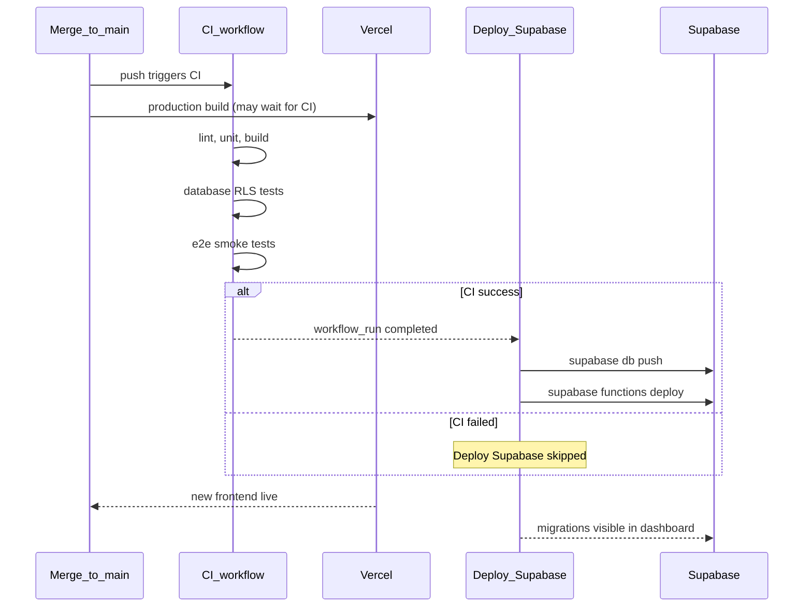

# Contributing to Bucket My Money

How we ship changes safely: branches, CI, GitHub, and Vercel.

## Environments (no cross-pollution)

| Environment | Frontend | Database |
| ----------- | -------- | -------- |
| **Production** | [bucketmymoney.com](https://bucketmymoney.com) | Hosted Supabase (dashboard project) |
| **Local dev** | `npm run dev` (:5173) | Docker via `npm run db:start` |
| **CI** | Built in Actions (placeholder or local Supabase env) | Throwaway Supabase in the runner only |

Pushes and CI **do not** reset or seed production. Migrations and Edge Functions
reach production via **[`deploy-supabase.yml`](./.github/workflows/deploy-supabase.yml)**
after green CI on `main` (see [README § Production Supabase deploy](./README.md#production-supabase-deploy-one-time-secrets)).

## Branch workflow

**Do not push directly to `main`.** Use a branch and open a pull request.

```bash
git checkout -b feat/my-change
# … edit, commit …
git push -u origin feat/my-change
gh pr create --title "v1.1.21: Short description of the change"
```

Merge when all required checks are green.

### Bump `package.json` version on every PR

Each PR should increment the app semver in [`package.json`](./package.json)
(and let `package-lock.json` follow — run `npm install --package-lock-only`
if you only changed the version). **Settings** and **Admin** show this
number at the bottom of each tab via [`src/lib/appVersion.ts`](./src/lib/appVersion.ts)
(baked in at build time).

| Change | Bump |
| ------ | ---- |
| Fixes, copy, small UX | patch (`1.0.2` → `1.0.3`) |
| New user-facing capability | minor (`1.0.3` → `1.1.0`) |
| Breaking change | major (`1.1.0` → `2.0.0`) |

Include the version bump in the same PR as the feature or fix — not a
follow-up on `main`.

**PR title:** Always lead with the version you are shipping — same semver as
the bump in `package.json`, prefixed with `v`:

```text
v1.1.21: Kid balance refresh and admin bank activity
```

Use this on `gh pr create --title "…"` and when editing the title in GitHub.
The version in the title must match the PR’s `package.json` bump (not the
version currently on `main`).

**Once per PR, from `main`.** Bump exactly one patch/minor/major step from the
version on `main` when you open the PR (or in the final commit before merge).
While iterating on the same branch before the PR lands, do **not** bump again
after each local milestone — that skips numbers (e.g. `1.1.4` → `1.1.6` with
no `1.1.5` release). After a PR merges, pull `main` and bump from the new
version for the next PR.

### One PR at a time — always branch from current `main`

We ship **one open PR at a time**. After a PR merges, reset your local tree
before starting the next change so branches do not diverge and fight over the
same files (e.g. two PRs both editing `App.tsx`).

**After every merge (you or the agent):**

```bash
git checkout main
git pull origin main
# optional: delete the merged branch locally and on GitHub
git branch -d feat/my-change
git push origin --delete feat/my-change   # if still on remote
git checkout -b feat/next-thing           # new branch, never reuse the old one
```

**Do not:**

- Keep committing on a branch after its PR has merged.
- Open PR #2 from a branch that was cut **before** PR #1 merged (rebase onto
  `main` first, or cut a fresh branch from `main` and cherry-pick if needed).

**Agents:** before any new feature/fix, confirm `git branch --show-current` is
a **new** branch based on up-to-date `origin/main`, not a stale or merged branch.

### GitHub branch protection (`main`)

**Use the repository ruleset only** — do not also require the same checks in
classic branch protection. Duplicating them makes every PR show doubled
“Expected” checks and adds noise without extra safety.

**Configured on this repo:**

- **Repository ruleset** [`main`](https://github.com/ecuaryan/bucket-my-money/rules/16950243): PR required, three status checks (strict), no force-push, no branch delete. Applies to everyone (no bypass actors).
- **Classic branch protection:** should be **off** or must **not** list required status checks. If you still see doubled checks on PRs, remove the three check names under **Settings → Branches → `main` → Edit** (keep the ruleset).

Required check names (must match [`.github/workflows/ci.yml`](./.github/workflows/ci.yml) job `name:` fields exactly):

- `lint, unit test, build`
- `database RLS tests`
- `e2e smoke tests`

**Workflow:** branch → push → open PR → wait for green CI → merge. Do not `git push origin main`.

To change rules: **Settings → Rules → Rulesets** (preferred). Avoid re-adding the same checks under **Settings → Branches**.

### Vercel (production should wait for CI)

Vercel builds the static app quickly; GitHub Actions (Supabase + tests) takes longer. Without gating, production can update before CI finishes.

**Project → Settings → Git → Deployment Protection** (production):

- Enable **Wait for GitHub checks** (or equivalent).
- Require the same three check names as above.

Result: merge to `main` only after PR CI passes; production promotes only after checks pass on that commit.

Preview deployments for PRs are optional; use separate Supabase env vars for previews if you add real users later (avoid previews hitting production data).

## CI jobs

Every push to `main` and every pull request runs [`.github/workflows/ci.yml`](./.github/workflows/ci.yml):

| Job | What it runs | Typical PR time |
| --- | ------------ | --------------- |
| `lint, unit test, build` | ESLint, Vitest unit tests, production build — **always full** | ~1 min |
| `database RLS tests` | Local Supabase + `tests/db/*.test.ts` when the diff can affect Postgres (RLS, RPCs, `src/lib`, migrations, etc.) | ~2 min when running; seconds when skipped |
| `e2e smoke tests` | Local Supabase + Playwright (`tests/e2e/`) when the diff is not docs-only | ~2 min when running; seconds when skipped |

**Regression coverage (what each layer catches):**

| Layer | Catches |
| ----- | ------- |
| Lint + unit + build | TypeScript/React bugs, broken imports, bad copy in tests, PWA build failures |
| Database RLS tests | Tenant isolation, child lockdown, `move_money` / `send_money` invariants, policy regressions |
| E2E smoke | Auth routing, login → Buckets, bucket rename/delete UX against real local Supabase |

**Speed without cutting corners:**

- A lightweight `detect changed scope` job classifies the git diff ([`scripts/ciChangedScope.mjs`](./scripts/ciChangedScope.mjs)). When uncertain, both expensive jobs run (fail-safe). Skipped jobs still **report success** so required checks pass.
- **Playwright:** browsers live in Actions cache; `install --with-deps` runs only on cache miss (not every job).
- **Supabase in CI:** `supabase start --exclude …` omits Studio, Storage, Inbucket, Edge runtime, and logging sidecars — enough for db tests and smoke e2e (Postgres, Auth, REST, Realtime). Docker image caching is intentionally **not** used; Supabase upstream found it slower than fresh pulls.

**Typical wall-clock:** docs-only PR ~1 min; UI-only PR ~3 min; schema/RPC PR ~3 min (db + e2e run in parallel).

## Local commands

```bash
npm test              # unit tests (no Docker)
npm run test:db       # database tests (Docker + supabase start)
npm run test:e2e      # Playwright (first time: npx playwright install chromium)
npm run check:full    # lint + unit + db + build (not e2e)
```

Local Supabase env: `source scripts/env-local.sh` (see [README.md](./README.md)).

## When you change…

| Change | Add / run |
| ------ | --------- |
| RLS policies | Cases in `tests/db/rls.test.ts` or new file under `tests/db/` |
| `move_money` or money RPCs | `tests/db/move_money.test.ts` |
| Transaction visibility | `tests/db/transactions.test.ts` |
| Auth helpers | `src/lib/*.test.ts` |
| Login / home smoke | `tests/e2e/smoke.spec.ts` |

## Deploying backend changes

Frontend and hosted Supabase are **separate pipelines**. Vercel finishing does
not mean migrations are live yet.

### Production deploy sequence



| Step | Workflow | What it touches |
| ---- | -------- | --------------- |
| 1 | [**CI**](./.github/workflows/ci.yml) | Lint, tests, build; local throwaway Supabase in the runner only |
| 2 | [**Deploy Supabase**](./.github/workflows/deploy-supabase.yml) | Hosted Postgres migrations + Edge Functions (runs only after green CI on `main`) |
| 3 | **Vercel** | Static frontend at [bucketmymoney.com](https://bucketmymoney.com) |

**Typical timing:** merge → CI runs several minutes → **Deploy Supabase** starts
when CI completes → check **Database → Migrations** in the Supabase dashboard
for the new file. The Vercel deployment can look “done” while CI or Deploy
Supabase is still running.

**PRs never touch production** — only merges to `main` trigger hosted deploys.

**Agents:** merging a PR that adds migrations is sufficient. **Do not** tell the
user to run `supabase db push` on their machine after merge — hosted schema is
applied by **Deploy Supabase** automatically (see table above). Manual CLI
deploy is documented below only as a fallback when that workflow fails.

### If frontend and backend are out of sync

Symptoms: new UI calls a missing RPC, or Edge Function behavior is stale while
the site already updated.

| Check | Action |
| ----- | ------ |
| CI still running on `main` | Wait — Deploy Supabase has not started |
| CI failed | Fix and merge a follow-up; Deploy Supabase will not run |
| **Deploy Supabase** failed | Open that workflow run on GitHub; fix secrets or `db push` errors |
| Deploy succeeded | Confirm migration in Supabase → **Database → Migrations** |

One-time GitHub **production** environment secrets: [README § Production Supabase deploy](./README.md#production-supabase-deploy-one-time-secrets).

Manual fallback (hosted DB — use with care):

```bash
npx supabase link
npx supabase db push
npx supabase functions deploy
npx supabase unlink
```

Edge Function **secrets** (`TELLER_SIGNING_SECRET`, service role, etc.) stay in the
Supabase dashboard / `supabase secrets set` — deploy only ships function code.

See [README.md § Before connecting real Teller data](./README.md) for security TODOs.
See [README.md § Production database](./README.md#production-database) for hosted DB access.
