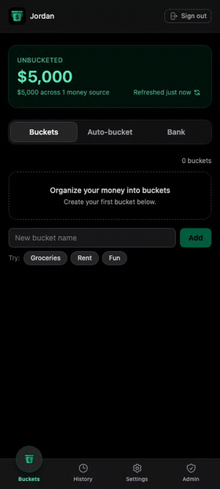
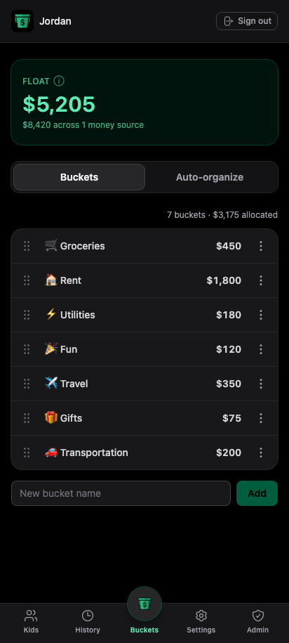
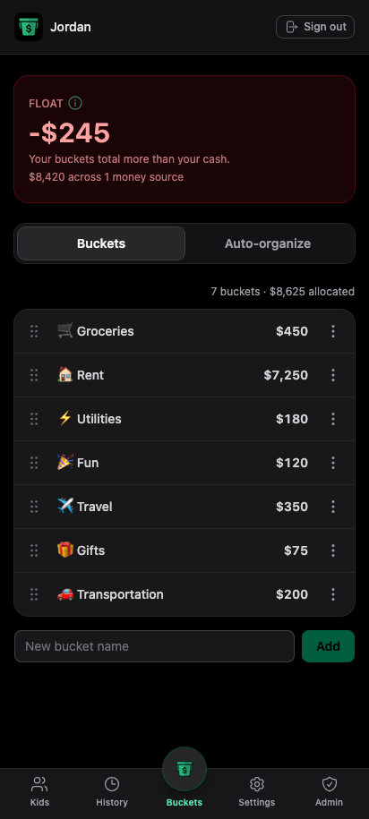
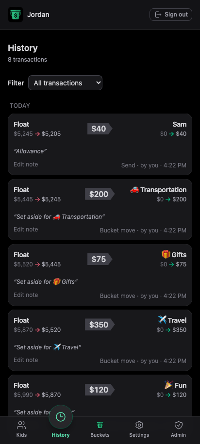
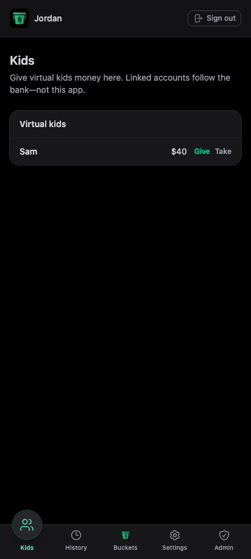

<p align="center">
  <a href="https://bucketmymoney.com">
    
  </a>
</p>

# Bucket My Money

**Live:** [bucketmymoney.com](https://bucketmymoney.com)

Bucket My Money is a progressive web app for organizing cash into **buckets**
— so you know what's actually available, not just what your bank shows. Use it
solo or with a shared household: connect read-only bank accounts, set money aside
from **Float**, and see where your money is at a glance. When the bank balance
moves, pick which bucket covers it.

## Demo

Your bank shows one balance. Buckets show where that money actually is —
create a few, set money aside from **Float**, and put them in the order that
fits your life.

<p align="center">
  
</p>

## Screenshots

Installable progressive web app with phone-sized UI — Buckets, History, and Kids.
Regenerate after significant UI changes ([docs/MAINTENANCE.md § PWA assets](./docs/MAINTENANCE.md#regenerating-readme--pwa-assets)).

<p align="center">
  
  
</p>
<p align="center">
  
  
</p>

## What it does

- **Float + buckets** — cash not yet labeled lives in **Float**; buckets are money
  you've set aside. The invariant is enforced in Postgres (`move_money`, `send_money`).
- **Household roles** — admin, shared member, and kid views with RLS tenant isolation
  and PIN login for members.
- **Move and send money** — set aside from Float, cover spends, send to kids; History
  with pagination and notes.
- **Read-only bank link** — Teller Connect, webhooks, manual money sources for onboarding.
- **Auto-organize** — scheduled or on-demand rules to set aside into buckets (`pg_cron` on hosted).
- **PWA** — offline fallback, service worker, install screenshots; session-scoped auth.
- **Tests** — Vitest unit tests, database RLS/RPC tests, Playwright smoke e2e; CI on every PR.

Product truth and balance model: [CONTEXT.md](./CONTEXT.md).

## Stack

- Vite + React 19 + TypeScript
- Tailwind CSS v4 (CSS-first — see [docs/MAINTENANCE.md](./docs/MAINTENANCE.md))
- `vite-plugin-pwa` (manifest + service worker)
- React Router 7
- Supabase (Auth, Postgres, Realtime, Edge Functions)
- Teller API (read-only bank connection)

## Architecture

```
src/
  components/{ui,layout}/   reusable primitives + app shell
  features/                 auth, buckets, sends, history, admin
  lib/                      supabase, auth, buckets, accounts
  hooks/                    shared React hooks
  types/                    DB types (supabase gen types)
  sw.ts                     PWA service worker (injectManifest)
public/
  icons/                    PWA icons
  screenshots/              install UI assets
  demos/                    README demo GIF
supabase/
  migrations/               SQL migrations (00000000000000 … 00000000000061)
  functions/                Deno Edge Functions
```

| Edge Function | Purpose |
| ------------- | ------- |
| `teller-enroll` | Store enrollment + sync accounts |
| `teller-enrollments-list` | List enrollments for Reconnect |
| `teller-disconnect` | Revoke enrollment + delete local rows |
| `teller-webhook` | Verify signature, refresh balances |
| `check-invariant` | Ledger check stub (deferred) |

## Local development

```bash
npm install
cp .env.example .env.local
npm run db:start          # first time: Docker + local Supabase (~1 min)
source scripts/env-local.sh && npm run dev
```

Open [http://127.0.0.1:5173](http://127.0.0.1:5173). Try demo data: `npm run db:reset:seed -- household`
then sign in as `household@bmm.dev` / `asdfasdf`.

| Command | Purpose |
| ------- | ------- |
| `npm run check:full` | Lint + unit + database tests + production build |
| `npm run test:db` | RLS and money RPC tests (needs `db:start`) |
| `npm run test:e2e` | Playwright smoke (needs `db:start`) |

Full command list, seed scenarios, PWA asset regen, and security checklists:
[docs/MAINTENANCE.md](./docs/MAINTENANCE.md). PR workflow and CI:
[CONTRIBUTING.md](./CONTRIBUTING.md).

## Documentation

| Document | Contents |
| -------- | -------- |
| [CONTEXT.md](./CONTEXT.md) | Product brief, balance model, schema, security |
| [docs/BRAND.md](./docs/BRAND.md) | Voice, Float terminology, product narrative |
| [docs/AUTO_ORGANIZE.md](./docs/AUTO_ORGANIZE.md) | Auto-organize feature and cron |
| [CONTRIBUTING.md](./CONTRIBUTING.md) | Branch/PR workflow, CI, deploy sequence |
| [AGENTS.md](./AGENTS.md) | Entry point for AI coding agents |
| [docs/MAINTENANCE.md](./docs/MAINTENANCE.md) | Dev commands, seeds, TODOs, Teller/prod ops |

## License

Proprietary — all rights reserved. Side project / portfolio piece; not open
source. See [LICENSE](./LICENSE).
